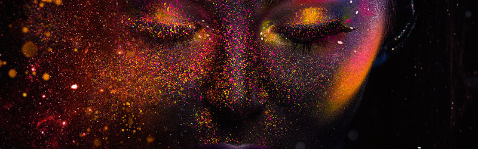

<h3 class="page-subtitle">Groundbreaking contents for space and locations</h3>

<h4 class="page-subtitle">Jeju  LED ART FESTA</h4>
A wonderland of light, art, and kinetic experience, LED ART FESTA takes place on an enchanting island of Jeju, South Korea. Headlined by Bruce Munro, an artist best known for immersive large-scale light-based installations inspired by his interest in shared human experience, and 20 other international leading light artists, the 19-acre former tea museum site will be transformed into an indoor and open-air festival, an extraordinary experience that expands the imagination and stimulates the senses of visitors. Once it opens its door in 2018, over 4000 visitors per year are anticipated and plans are underway to bring the festival to Qatar, Morocco, and China. 

<h4 class="page-subtitle">LIGHTship</h4>
A transformative and mind blowing play of visuals, audio, and ultra high-definition technology in a giant, seamless dome, LIGHTship is an immersive experience. Past clients include Cartier and this installation will be a prominent feature of Jeju LED ART FESTA. 
