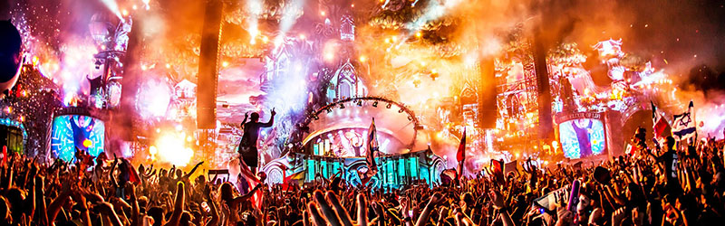

<h3 class="page-subtitle">The team behind transcontinental meeting of minds with lasting impact</h3>

<h4 class="page-subtitle">SUMMIT: JEJU</h4>
The world’s preeminent festival of ideas, Summit hosts a diverse array of talks, performances, wellness classes, art installations, gourmet food, and intimate spaces designed to foster relationships and inspire new perspectives. Summit is an annual festival held in the US by invitations only and has recently chosen Jeju, Korea to host its first Aian gathering. 

<h4 class="page-subtitle">Electric Zoo Festival <a class="title-link" href="http://electriczoofestival.com/">[more info]</a></h4>
One of New York City’s largest music festivals and features the top names in electronic music, Electric Zoo Festival brings a wide variety of acts from around the world and across the spectrum of electronic music’s various sub-genres. International editions of Electric Zoo have taken place in Mexico City, Tokyo and Shanghai, with Electric Zoo: São Paulo scheduled for  April and further expansion underway. 
