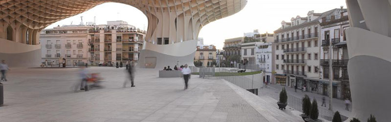

<h3 class="page-subtitle">Unique and viable from conception, harnessing the energy of tomorrow</h3>

<h4 class="page-subtitle">Connecting formidable market demands with the decision makers, we seize formidable market trends.</h4>   
The first premier resort for cats and dogs under way in South Korea to meet the exploding demands of pet industry and to serve the new generation of pet owners. The first full service pet resort in Korea builds is being developed in partnership with [Paradise 4 Paws](http://www.paradise4paws.com/), a leading operator of pet resorts across the US.

Haenam Oceano Project re-imagines a lush, sea-swept southernmost region of Korea with a high-concept resort that features wellness retreat, designer hotel, luxury retail, augmented reality experience, drone racing, and interactive contents labs.

Building Smart Solar Cities in the Middle East in partnership with [Adenium Capital](http://www.adeniumcapital.com/). Based in Dubai, Yellow Door Energy initiatives offer solar leasing solutions to the end electricity consumers in the commercial and industrial market in the Middle East.  

